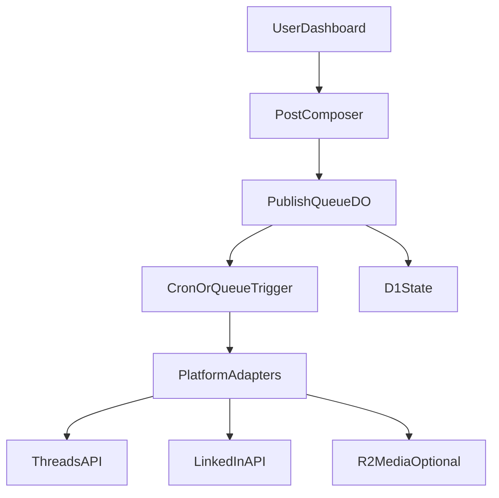

# Organizing Vocino

**A personal-first social publishing dashboard for professional channels.**

Organizing Vocino is a small app for planning, scheduling, and publishing posts across the social accounts that matter for your work—starting with **Threads** and **LinkedIn**. Think of it as a focused alternative to juggling multiple tabs and native schedulers: one place to compose, queue, and track what went out.

The project lives at [vocino.org](https://vocino.org) and is built for **Vocino’s own workflow first**. The code is open source so others can learn from it, fork it, or self-host with their own API credentials—without routing traffic through anyone else’s keys or quotas.

---

## Why this exists

Posting consistently across professional networks is fragmented: each platform has different limits, media rules, and scheduling UX. This repo is an experiment in **owning that workflow**: a single dashboard that scrolls through accounts and content state, similar in spirit to tools like Buffer—but scoped to what actually gets used for work, with room to grow.

Starting with **Threads** and **LinkedIn** keeps V1 realistic while covering two high-signal professional surfaces.

---

## V1 features (planned)

- **Connections** — Link Threads and LinkedIn accounts via platform OAuth (credentials stored only in your environment / Cloudflare secrets, not in the repo).
- **Composer** — Draft posts; optional per-platform variants (length, mentions, media).
- **Scheduling & queue** — Schedule publishes and process them through a reliable queue + triggers.
- **Status** — Minimal visibility: published, failed, retry—enough to trust the system without building a full analytics product.

---

## Non-goals (for now)

- Full **SaaS** onboarding, billing, or multi-tenant product polish.
- **Every** social platform on day one (Instagram, Discord, X, etc. come later if they still fit).
- **Team** collaboration (roles, approvals, shared calendars)—solo / personal use first.

---

## Architecture (Cloudflare-first)

The intended stack for the hosted instance is **Cloudflare**:

| Piece | Role |
|--------|------|
| **Workers** | HTTP API, auth callbacks, webhooks if needed |
| **Durable Objects** | Coordination for publish queue / per-user or global sequencing |
| **D1** | Metadata: drafts, schedules, publish attempts, platform account refs |
| **R2** *(optional)* | Media uploads / attachments |
| **Queues + Cron** | Scheduled publishing and retries |

Forks and self-hosters can swap hosting details; the README stays honest that **your** deployment is Cloudflare-first.

---

## Open source posture

- **Public repo** — Anyone can read the code. Design and copy should assume that.
- **Bring your own API credentials** — If you fork or self-host, you register apps with Meta (Threads), LinkedIn, etc., and supply secrets via environment / Cloudflare Secrets—not shared with the original author’s quotas.
- **Personal hosted path** — The primary story is: one person (Vocino) runs the real instance on Cloudflare; others clone and run their own stack if they want.

---

## Security & public-repo safeguards

This repository must **never** contain:

- API keys, client secrets, or long-lived tokens  
- `.dev.vars`, `.env` files with real values  
- Exported OAuth tokens or database dumps with PII  

**Practices:**

1. Use **Cloudflare Secrets** (and local `.dev.vars` only on disk, gitignored) for all third-party credentials.
2. Keep a **strict `.gitignore`** for env files, wrangler local state, and credential artifacts.
3. **Do not log** raw access tokens or refresh tokens; log opaque IDs and high-level errors only.
4. Prefer **short-lived tokens** and refresh flows where platforms allow; encrypt sensitive fields at rest in D1 when you store them (design goal—implement as the app lands).
5. Run **secret scanning** (e.g. GitHub push protection, `gitleaks`, or similar) before and after meaningful changes.

**Pre-push checklist (quick):**

- [ ] `git status` — no unexpected files (especially env or credential dumps).
- [ ] No secrets in diff (`git diff` / review in GitHub UI).
- [ ] Screenshots or docs redact tokens and real account handles if needed.

If anything sensitive is ever pushed, **rotate credentials immediately** and consider history cleanup per your host’s docs.

---

## Quick start (assumptions)

> The app code is not in this repo yet; this section describes the intended path once Workers + frontend exist.

1. Clone the repo and install dependencies (exact commands will live in the project root once added).
2. Create developer apps for **Threads** (Meta) and **LinkedIn**; note client ID, client secret, and redirect URLs matching your Worker routes.
3. Set secrets via `wrangler secret put …` (or the Cloudflare dashboard)—**never** commit them.
4. Apply D1 migrations and deploy Workers + any Pages frontend.

Details will be expanded when `wrangler` config and source land in the tree.

---

## Roadmap

| Phase | Focus |
|--------|--------|
| **Now** | README + repo hygiene; scaffold Cloudflare app; Threads + LinkedIn OAuth + publish MVP |
| **Next** | Instagram, Discord, or other platforms if APIs and use case still align |
| **Later** | Optional hosted offering for others (BYO keys or small fee)—out of scope until core is stable |

---

## Contributing

Issues and PRs are welcome once there is code to contribute to. Please keep changes aligned with the **public-repo security** section above.

---

## License

See [LICENSE](LICENSE).
