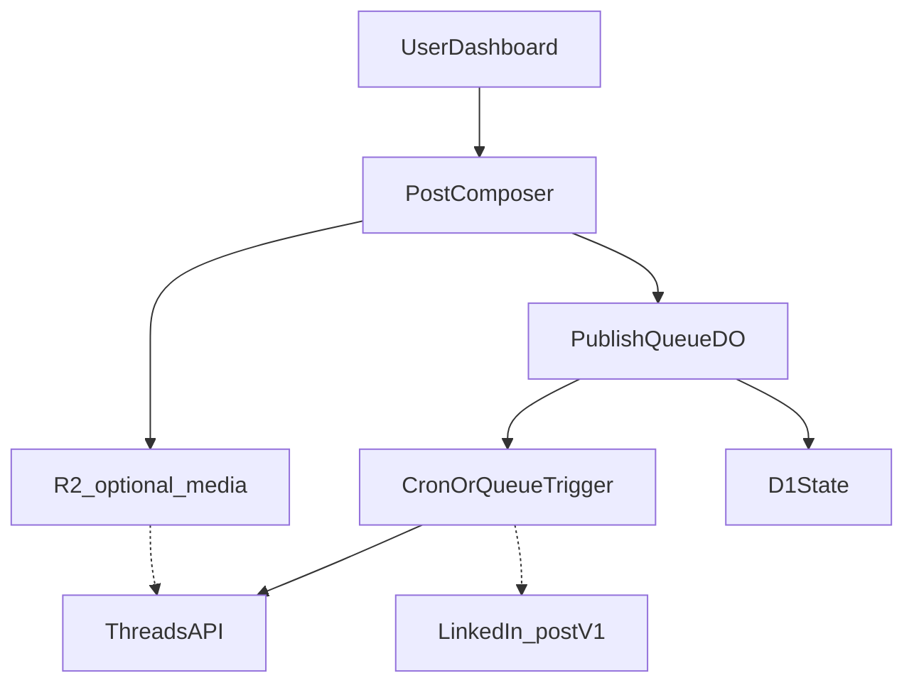

# Organizing Vocino

**A personal-first social publishing dashboard for professional channels.**

Organizing Vocino is a small app for **owning how and when you post**. **V1** is deliberately narrow: a **Threads** publishing flow that feels like **Buffer**—you build a **backlog** of posts, define **when** they should go out across the day, and the system **publishes automatically** via the Meta API. **LinkedIn** and other networks stay on the roadmap until that core loop feels solid.

The project lives at [vocino.org](https://vocino.org) and is built for **Vocino’s own workflow first**. The code is open source so others can learn from it, fork it, or self-host with their own API credentials—without routing traffic through anyone else’s keys or quotas.

---

## Why this exists

Posting consistently across professional networks is fragmented: each platform has different limits, media rules, and scheduling UX. This repo is an experiment in **owning that workflow**: a single dashboard that scrolls through accounts and content state, similar in spirit to tools like Buffer—but scoped to what actually gets used for work, with room to grow.

**V1** optimizes for one habit: **keep a queue of Threads posts and let software post them on a rhythm you trust**, instead of context-switching into the app all day.

---

## V1 features (planned) — Threads queue & schedule

**Primary goal**

- **Backlog + automatic posting** — Add many posts to a **queue**; at **configured times** (or equivalent triggers), the next ready item publishes to **Threads** without manual action—same mental model as Buffer’s queue and posting schedule.

**Core mechanics**

- **Threads connection** — One account via **Meta OAuth** (credentials only in Cloudflare Secrets / `.dev.vars`, never in git).
- **Composer** — Create and edit queued posts within Threads limits (text, media, optional multi-post threads—see behavior section below).
- **Posting schedule** — You define **slots** (e.g. “9:00, 13:00, 18:00” in your timezone). When a slot fires, if the backlog has a **ready** item, publish it and record success/failure.
- **Ordering** — Clear **FIFO** (or explicit reorder) so “what goes next” is predictable.
- **Status** — Minimal: queued, published, failed, retry—enough to trust the system, not a full analytics product.

**Bonus (stretch within or right after V1)**

- **Dynamic / gap-based publishing** — In addition to (or instead of) fixed clock slots, support a rule such as: **if the last successful publish was more than *X* hours ago** and the backlog is non-empty, **publish the next post** (subject to optional **daily caps** so the queue cannot empty itself into spam). Exact UX (toggle per account, combine with slots, quiet hours) can be decided during implementation.

The **Threads** subsection below covers API-facing limits and limitations. **LinkedIn** is specified for a **later phase** so the README stays a useful contract without pretending V1 ships two networks.

---

## Platform behavior (Threads V1, LinkedIn later)

### Threads integration (target behavior)

**Accounts & connection**

- Authenticate via **Meta** (Threads is tied to **Instagram**): user must have a Threads profile linked to Instagram as Meta expects.
- Typically **public** Threads accounts only for third-party publishing flows—do not promise private-profile support unless the API explicitly allows it.
- Request the minimum OAuth scopes your app needs (e.g. account/read vs publish); product docs often cite scopes such as **`threads_basic`** and **`threads_content_publish`**—confirm names and combinations against [Meta’s current Threads API documentation](https://developers.facebook.com/docs/threads).

**Publishing features**

| Spec | Target |
|------|--------|
| Max text length | **500 characters** (enforce in composer). |
| Images / videos per post | Up to **10** items (carousel) where the API allows. |
| Video length | Up to **~5 minutes** (validate server-side). |
| Video aspect ratio | Roughly **0.01:1** through **10:1** (reject out-of-range uploads early when possible). |
| Thread chains | Support scheduling a **thread** (sequence of posts); product goal **up to ~50** posts in one scheduled thread, published in order with correct reply/parent linkage per API. |
| Mentions | **`@username`** in copy where the API supports mentions. |
| Links | URLs in text become **clickable links** when the platform renders them (no fake “preview builder” unless the API exposes one). |
| Direct scheduling | **Yes** — publish at scheduled time via API (no “mobile notification tap to post” workflow as the primary path). |

**Scheduling semantics (V1)**

- **Fixed slots** — Cron (or queue consumers on a timer) fires at your **wall-clock times** in a chosen **timezone**; each tick asks the queue for the **next** eligible item and calls Threads publish.
- **Gap-based (bonus)** — A separate check (same or lower-frequency cron) compares **now** to **timestamp of last successful publish**; if elapsed ≥ **X hours** and the backlog is non-empty, dequeue and publish—optionally capped by **max posts per day** so rules cannot fight each other.
- **Interaction** — Slots and gap rules should be **explicitly ordered** in product logic (e.g. slot wins, or gap only fills between slots) so behavior is debuggable.

**Known limitations (communicate in UI)**

- **No in-dashboard analytics** for Threads in V1 if the API does not expose performance metrics you are allowed to use.
- **No engagement inbox** — no replying, liking, or unified “Threads inbox” from this app unless APIs and scope expand later.
- **No image alt text** if the publishing API does not support it.
- **No platform “tags” / location** features that Meta does not expose to third-party publishers.
- **No “first comment”** scheduling as a separate feature (unlike LinkedIn-style flows)—Threads behavior is thread-of-posts instead.
- **Rate limits / throttling** — backoff, spacing between publishes, clear errors; respect Meta limits.

**Workflow**

- **V1 backlog** — Posts live in a **queue**; **fixed daily slots** (and optionally **gap-since-last-post** rules) decide **when** the next item is published. One-off “post at this exact timestamp” can reuse the same machinery (single slot or immediate enqueue + flush).
- **Multi-post Threads** (a thread of up to ~50 posts) can be modeled as **one queue item** that expands to an ordered publish sequence; **partial failure** must be visible (which segment failed, what to retry).
- **Analytics** and **engagement** are **out of scope** for V1 unless you later add scopes and storage for data Meta actually returns.

---

### LinkedIn integration (post-V1 specification)

_Not part of shipping V1; kept so product and API constraints are documented when you add a second network._

**Accounts & connection**

- Support **LinkedIn Profile** and **LinkedIn Page** destinations where the API permits.
- For **Pages**, assume the connecting user has sufficient admin (e.g. Super Admin / Content Admin—exact names depend on LinkedIn’s product UI).
- Use **OAuth**; expect **periodic re-authentication** when refresh fails or policies expire (often on the order of weeks, not “set and forget forever”).

**Post types (profiles vs pages)**

Exact matrix depends on LinkedIn API version and app approval; the **product goal** is parity where the platform allows:

| Capability | Target |
|------------|--------|
| Text | Yes, enforce **~3,000 characters** (validate in composer). |
| Images | Yes; **up to 9** images per post where supported. |
| Video | Yes where supported. |
| Links | Yes; **link preview** (title/description/thumbnail) when the API exposes it. |
| First comment | Yes as a **second step**: publish main post, then post the “first comment” once the parent id is known (same scheduling story, two API actions). |
| @mentions | **Pages only** where the API allows; **do not promise** @mention of personal profiles (LinkedIn restricts this for third parties). |
| Image alt text | Yes for accessibility when the API supports it. |
| Document / PDF carousel | Yes when the API supports document posts. |

**Media validation (backend / UX guardrails)**

Use these as defaults to fail fast before upload; adjust when LinkedIn’s docs change.

- **Images:** e.g. **≤ 10 MB**; **JPG, PNG, non-animated GIF**; aspect ratio guidance **~1.91:1 to 4:5** where relevant.
- **Video:** e.g. **≤ 200 MB**; **~3 s–10 min** duration; common containers (**MP4**, **WebM**, **MKV**, etc.); resolution roughly **256×144** through **4096×2304**; frame rate **~10–60 fps**.

**Known limitations (communicate in UI)**

- No **Stories** or **Live** via third-party APIs (do not surface as options).
- **Throttling / rate limits** — backoff, queue spacing, and clear user-visible errors when LinkedIn returns quota or abuse signals.
- **No personal-profile @mentions** if the API cannot deliver them.

**Workflow** _(when LinkedIn ships)_

- Reuse the same **backlog + schedule** ideas as Threads where LinkedIn’s API allows (per-post datetime, queue slots, or both).
- **Multi-user approvals** remain out of scope until well after solo publishing is solid (see Non-goals).
- **Analytics** (likes, comments, impressions, clicks) is a **stretch** after reliable cross-network publish + status.

---

## Non-goals (for now)

- **LinkedIn (and other networks) as V1 publish targets** — V1 ships **Threads only**; everything else stays specification or roadmap.
- Full **SaaS** onboarding, billing, or multi-tenant product polish.
- **Every** social platform on day one (Instagram, Discord, X, etc. come later if they still fit).
- **Team** collaboration (roles, approvals, shared calendars)—solo / personal use first.

---

## Architecture (Cloudflare-first)

The intended stack for the hosted instance is **Cloudflare**:

| Piece | Role |
|--------|------|
| **Workers** | HTTP API, auth callbacks, webhooks if needed |
| **Durable Objects** | Coordination for **backlog order**, **last-publish time** (for gap rules), and **slot-driven** publishes |
| **D1** | Metadata: queue items, posting schedule config, publish attempts, Threads account ref |
| **R2** *(optional)* | Media uploads / attachments |
| **Cron** | **Slot ticks** and optional **gap-based** checks; **Queues** only if cron + DO is not enough later |

_V1 runtime path is Threads-only; additional adapters plug in later without changing the queue model._

Forks and self-hosters can swap hosting details; the README stays honest that **your** deployment is Cloudflare-first. For a **single-user** hosting layout (one Worker, bindings, cron, domain), see [docs/hosting.md](docs/hosting.md).

### Design (frontend)

The dashboard UI can take **layout, component, and Tailwind v4 structure** cues from TailAdmin (React + Vite) while **colors, typography, and atmosphere** follow **[vocino.com](https://vocino.com)**. See [docs/design.md](docs/design.md) for token tables, font stacks, and a practical mapping checklist.

---

## Open source posture

- **Public repo** — Anyone can read the code. Design and copy should assume that.
- **Bring your own API credentials** — If you fork or self-host, you register apps with Meta (Threads), LinkedIn, etc., and supply secrets via environment / Cloudflare Secrets—not shared with the original author’s quotas.
- **Personal hosted path** — The primary story is: one person (Vocino) runs the real instance on Cloudflare; others clone and run their own stack if they want.

---

## Security & public-repo safeguards

This repository must **never** contain:

- API keys, client secrets, or long-lived tokens  
- `.dev.vars`, `.env` files with real values  
- Exported OAuth tokens or database dumps with PII  

**Practices:**

1. Use **Cloudflare Secrets** (and local `.dev.vars` only on disk, gitignored) for all third-party credentials.
2. Keep a **strict `.gitignore`** for env files, wrangler local state, and credential artifacts.
3. **Do not log** raw access tokens or refresh tokens; log opaque IDs and high-level errors only.
4. Prefer **short-lived tokens** and refresh flows where platforms allow; encrypt sensitive fields at rest in D1 when you store them (design goal—implement as the app lands).
5. Run **secret scanning** (e.g. GitHub push protection, `gitleaks`, or similar) before and after meaningful changes.

**Pre-push checklist (quick):**

- [ ] `git status` — no unexpected files (especially env or credential dumps).
- [ ] No secrets in diff (`git diff` / review in GitHub UI).
- [ ] Screenshots or docs redact tokens and real account handles if needed.

If anything sensitive is ever pushed, **rotate credentials immediately** and consider history cleanup per your host’s docs.

---

## Quick start (assumptions)

> The app code is not in this repo yet; this section describes the intended path once Workers + frontend exist.

1. Clone the repo and install dependencies (exact commands will live in the project root once added).
2. Create a **Meta** developer app for **Threads** publishing; note client ID, client secret, and OAuth redirect URLs matching your Worker routes. (LinkedIn and other providers wait until you extend past V1.)
3. Set secrets via `wrangler secret put …` (or the Cloudflare dashboard)—**never** commit them.
4. Apply D1 migrations and deploy (see [docs/hosting.md](docs/hosting.md) for the recommended **single Worker + static assets** layout).

Details will be expanded when `wrangler` config and source land in the tree.

---

## Roadmap

| Phase | Focus |
|--------|--------|
| **Now** | README + repo hygiene; scaffold Cloudflare app; **Threads OAuth**; **backlog + daily posting slots**; publish MVP; optional **gap-since-last-post** mode |
| **Next** | **LinkedIn** (reuse queue/schedule model), then Instagram / Discord / others if APIs and use case still align |
| **Later** | Optional hosted offering for others (BYO keys or small fee)—out of scope until core is stable |

---

## Contributing

Issues and PRs are welcome once there is code to contribute to. Please keep changes aligned with the **public-repo security** section above.

---

## License

See [LICENSE](LICENSE).
